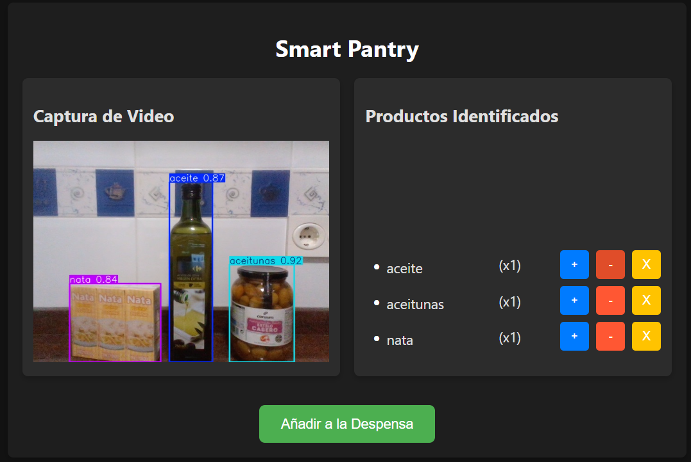
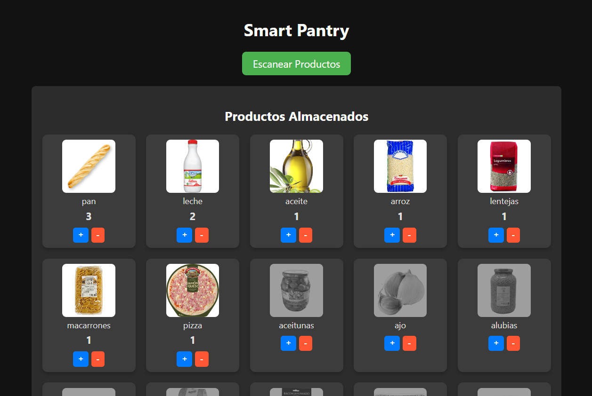

# SmartPantry
## Trabajo Fin de Grado - Sistema de detección de alimentos e inventario para cocinas inteligentes

**Smart Pantry** es una aplicación web diseñada para gestionar el inventario de alimentos en el hogar. Utiliza un modelo de reconocimiento de imágenes para identificar productos alimenticios, genera recetas basadas en los productos disponibles y crea menús semanales automáticamente.

## Características principales 🌟
- **Identificación de productos:** Escanea productos mediante la cámara y los identifica utilizando un modelo YOLO.
- **Gestión del inventario:** Permite ajustar manualmente las cantidades de productos identificados antes de agregarlos a la despensa.
- **Recetas automáticas:** Genera recetas basadas en los productos disponibles en la despensa.
- **Multiplicador de paquetes:** Ajusta automáticamente la cantidad de productos al añadirlos a la despensa según el contenido de los paquetes.

---

## Uso 🚀

### Identificar productos
1. Dirígete a la sección **Escanear Productos**.
2. Escanea los productos frente a la cámara.
3. Ajusta manualmente las cantidades si es necesario.

### Añadir productos a la despensa
1. Una vez escaneados los productos, haz clic en el botón **Añadir a la despensa**.
2. Los productos se almacenarán en la base de datos con cantidades ajustadas según el campo *multiplicador*.

### Generar recetas
1. Accede a la sección **Generar Receta**.
2. Se generará una receta basada en los productos disponibles en la despensa.

---

## Personalización 🔧

### Modificar el modelo YOLO
El modelo de reconocimiento se encuentra en `app/models/tfg_yolo11s.pt`.  
Puedes reemplazar este archivo con un modelo YOLO personalizado.

### Configuración del multiplicador
Los valores de *multiplicador* se configuran directamente en la base de datos.  
Puedes modificar estos valores en el script `reset_db.py` o directamente en tu sistema de gestión de bases de datos.

---

## Capturas de pantalla 🖼️

### Escaneo de productos:

### Despensa:

